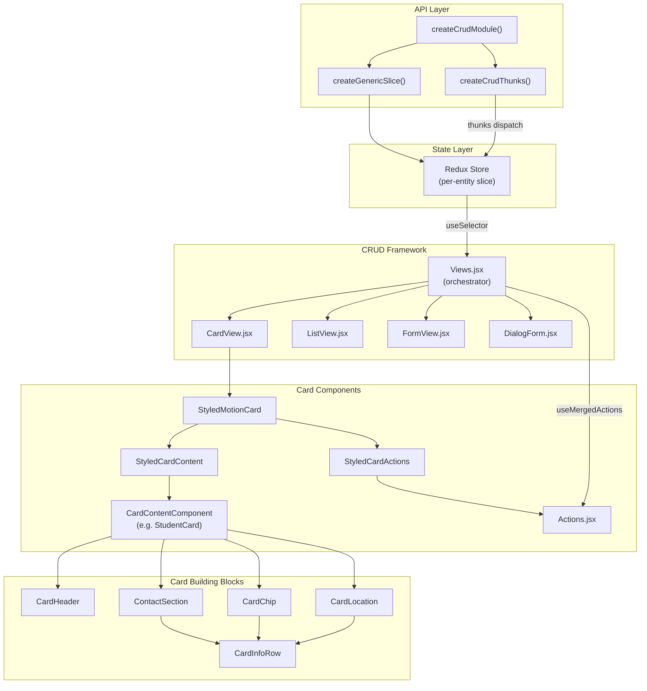
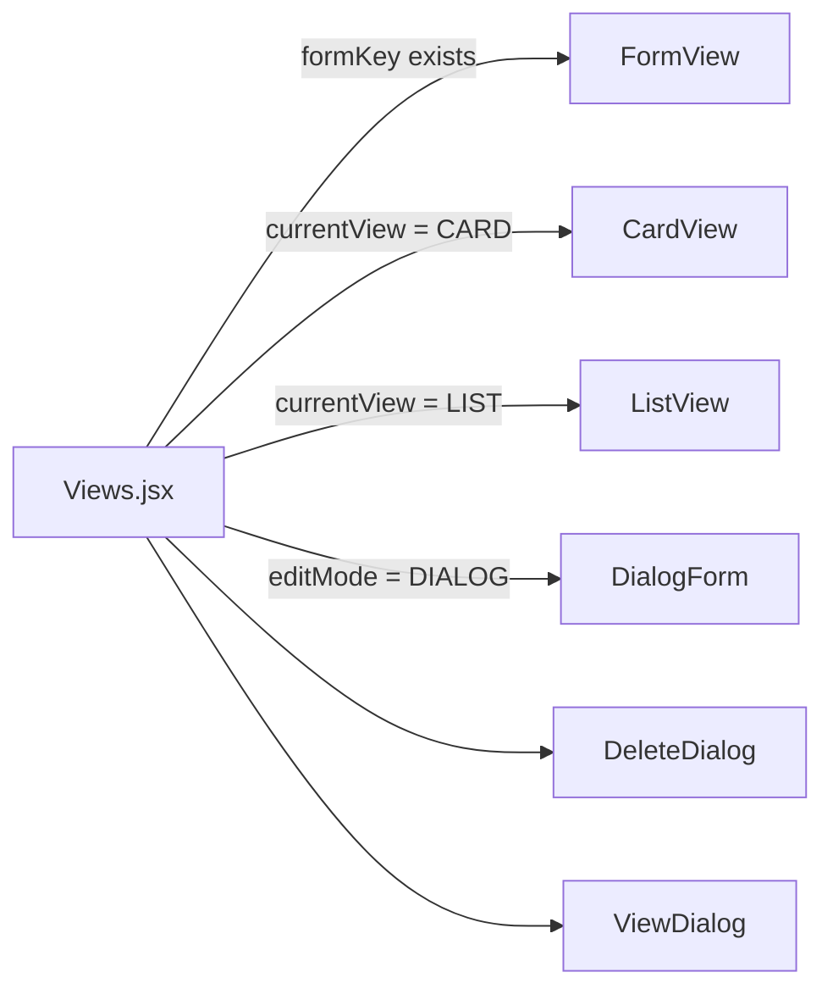
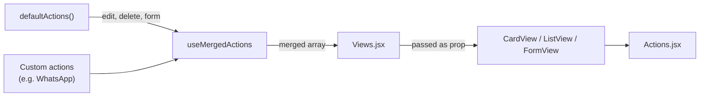
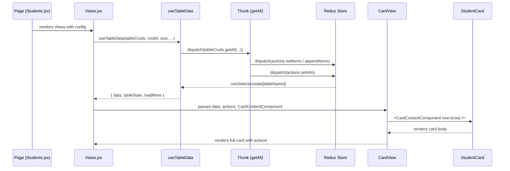

# Card System Architecture

> Architecture reference for the CRUD-driven card rendering pipeline.
> Covers data flow from API → Redux → Views → Card components → Actions.

---

## High-Level Overview



---

## Directory Structure

```
src/
├── core/
│   ├── api/
│   │   ├── createCrudModule.js    # Factory: slice + thunks for any entity
│   │   ├── thunk.js               # Generic CRUD thunks (getAll, add, update, remove, etc.)
│   │   └── helper.js              # Auth headers, cache validation, loading wrapper
│   │
│   ├── state/
│   │   └── createGenericSlice.js  # Redux Toolkit slice factory with standard reducers
│   │
│   ├── crud/
│   │   ├── Views.jsx              # Orchestrator: routes to CardView / ListView / FormView
│   │   ├── CardView.jsx           # Card grid view (infinite scroll, card-per-row)
│   │   ├── ListView.jsx           # Table view (desktop) + mobile row cards
│   │   ├── FormView.jsx           # Single-record detail/edit form
│   │   ├── DialogForm.jsx         # Edit form inside a dialog (DIALOG editMode)
│   │   ├── ViewTabs.jsx           # Tabs for nested sub-views inside FormView
│   │   ├── constant/
│   │   │   └── defaultActions.jsx # Default edit/delete/form actions
│   │   ├── hooks/
│   │   │   ├── useCrudAction.js   # Edit, save, cancel, add, change handlers
│   │   │   ├── useDeleteHandler.jsx # Delete confirmation dialog state
│   │   │   ├── useMergedActions.js  # Merges default + custom actions
│   │   │   └── useTableData.js    # Fetch, paginate, search, filter, infinite scroll
│   │   ├── helper/
│   │   │   └── Actions.jsx        # Renders action buttons (bottom bar in card view)
│   │   ├── components/
│   │   │   ├── shared.jsx         # FadeIn, RowActions, EmptyState, getRowNumber
│   │   │   ├── FieldCell.jsx      # Single field renderer for table/card cells
│   │   │   └── SaveCancelButtons.jsx
│   │   └── utils/
│   │       ├── validate.js        # Field validation before save
│   │       └── fieldHelpers.js    # Field value resolution utilities
│   │
│   └── components/
│       ├── cards/
│       │   ├── StyledCard.jsx     # Card wrapper: container grid, card shell, actions bar
│       │   ├── CardHeader.jsx     # Avatar + name + status chip
│       │   ├── CardInfoRow.jsx    # Generic icon + label + value row
│       │   ├── ContactSection.jsx # Email/phone row with copy + link actions
│       │   ├── CardChip.jsx       # Date/value row (delegates to CardInfoRow)
│       │   └── CardLocation.jsx   # Address row (delegates to CardInfoRow)
│       ├── fields/
│       │   ├── Field.jsx          # Universal field renderer (TEXT, IMAGE, SELECT, DATE, etc.)
│       │   ├── ImageComponent.jsx # Image upload/display with FileDropZone
│       │   └── StyledField.jsx    # FieldContainer, FieldLabel styled components
│       ├── layout/
│       │   └── FlexBox.jsx        # FlexBetween, FlexEvenly, FlexBetweenColumn, etc.
│       ├── dialogs/
│       ├── feedback/
│       ├── tables/
│       └── loading/
│
├── api/
│   └── all.api.js                 # All entity CRUD module instances
│
├── context/
│   └── UIContext.jsx              # isMobile, feature flags, isAdmin
│
└── Pages/Management/
    ├── Student/
    │   ├── Students.jsx           # Student page (fields, actions, views config)
    │   └── StudentCard.jsx        # Card content component for student entity
    ├── Client/
    │   └── Clients.jsx            # Same pattern: fields + Views + CardContentComponent
    ├── Expense/
    ├── Payments/
    ├── Booking/
    ├── Enquiry/
    ├── Instructor/
    ├── Branches/
    ├── TemplatesPage/
    └── Management.jsx             # Route switch: page param → component
```

---

## Data Flow

### 1. Entity Registration

Every entity (students, clients, expenses, etc.) is registered via a single factory call:

```js
// src/api/all.api.js
export const studentsCruds = createCrudModule({
    route: "students",
    idKey: "studentId",
});
```

This creates:
- A **Redux slice** (`createGenericSlice`) with standard reducers: `setItems`, `appendItems`, `addItem`, `updateItem`, `removeItem`, `setRecord`, `setInfo`, `clearData`
- **CRUD thunks**: `getAll`, `getById`, `add`, `update`, `remove`, `refresh`
- An **actions** object for dispatching reducers
- Optional **extraCruds** for entity-specific thunks (e.g. `markAttendanceBulk`)

### 2. Page Configuration

Each management page declares:

| Config | Purpose |
|--------|---------|
| `FIELDS[]` | Field definitions (name, label, type, validation, getValue, defaultValue, section) |
| `FIELD_META` | `{ primary: "studentId", root: "branchId" }` — identifies the PK and parent FK |
| `actions[]` | Custom actions beyond the default edit/delete (e.g. WhatsApp) |
| `CardContentComponent` | The card body component (e.g. `StudentCard`) |
| `currentView` | `"LIST"` (desktop) or `"CARD"` (mobile) — switched via `isMobile` |
| `editMode` | `"INLINE"` (edit in table), `"DIALOG"` (edit in popup), `"FORM"` (navigate to form page) |

### 3. Views Orchestrator

[Views.jsx](file:///home/ramramsa/files/studio_frontend/src/core/crud/Views.jsx) is the central hub:



It manages:
- **Data hooks**: `useTableData` (fetch, paginate, search, filter, infinite scroll)
- **CRUD hooks**: `useCrudAction` (edit, save, cancel, add, change)
- **Delete hooks**: `useDeleteHandler` (delete confirmation dialog)
- **Action merging**: `useMergedActions` (default actions + custom per-page actions)

### 4. Action Pipeline



**Default actions** (defined in [defaultActions.jsx](file:///home/ramramsa/files/studio_frontend/src/core/crud/constant/defaultActions.jsx)):
- `edit` — Opens inline/dialog/form editor
- `delete` — Opens delete confirmation dialog
- `form` — Navigates to `/management/{tableName}/{id}` (hidden when already in form mode)

**Custom actions** are appended after defaults. `useMergedActions` merges by name (overrides if name matches, appends if new).

---

## Card Rendering Pipeline

### CardView Layout

```
┌─────────────────────── StyledCardContainer (CSS Grid) ──────────────────────┐
│                                                                              │
│  ┌─── StyledMotionCard ───────────────────────┐  ┌─── StyledMotionCard ──┐  │
│  │  ┌─ StyledCardContent ──────────────────┐  │  │                       │  │
│  │  │  CardContentComponent (e.g. Student)  │  │  │       ...             │  │
│  │  │    ├── CardHeader                     │  │  │                       │  │
│  │  │    ├── ContactSection (email)         │  │  │                       │  │
│  │  │    ├── ContactSection (phone)         │  │  │                       │  │
│  │  │    ├── CardChip (dob)                 │  │  │                       │  │
│  │  │    └── CardLocation (address)         │  │  │                       │  │
│  │  └──────────────────────────────────────┘  │  │                       │  │
│  │  ┌─ StyledCardActions ──────────────────┐  │  │                       │  │
│  │  │     🗑️ Delete  ✏️ Edit  💬 WhatsApp   │  │  │                       │  │
│  │  └──────────────────────────────────────┘  │  │                       │  │
│  └────────────────────────────────────────────┘  └───────────────────────┘  │
│                                                                              │
└──────────────────────────────────────────────────────────────────────────────┘
```

### Component Hierarchy

| Component | Role | Location |
|-----------|------|----------|
| `StyledCardContainer` | CSS Grid for card layout | [StyledCard.jsx](file:///home/ramramsa/files/studio_frontend/src/core/components/cards/StyledCard.jsx) |
| `StyledMotionCard` | Animated card shell (framer-motion) | [StyledCard.jsx](file:///home/ramramsa/files/studio_frontend/src/core/components/cards/StyledCard.jsx) |
| `StyledCardContent` | Card body padding/layout | [StyledCard.jsx](file:///home/ramramsa/files/studio_frontend/src/core/components/cards/StyledCard.jsx) |
| `StyledCardActions` | Bottom action bar | [StyledCard.jsx](file:///home/ramsamra/files/studio_frontend/src/core/components/cards/StyledCard.jsx) |
| `CardHeader` | Avatar + name + status chip | [CardHeader.jsx](file:///home/ramramsa/files/studio_frontend/src/core/components/cards/CardHeader.jsx) |
| `CardInfoRow` | Generic row: icon + label + value + optional action | [CardInfoRow.jsx](file:///home/ramramsa/files/studio_frontend/src/core/components/cards/CardInfoRow.jsx) |
| `ContactSection` | Email/phone row with copy button and link | [ContactSection.jsx](file:///home/ramramsa/files/studio_frontend/src/core/components/cards/ContactSection.jsx) |
| `CardChip` | Date/value display row | [CardChip.jsx](file:///home/ramramsa/files/studio_frontend/src/core/components/cards/CardChip.jsx) |
| `CardLocation` | Address display row | [CardLocation.jsx](file:///home/ramramsa/files/studio_frontend/src/core/components/cards/CardLocation.jsx) |
| `Actions` | Renders action buttons with icon + label | [Actions.jsx](file:///home/ramramsa/files/studio_frontend/src/core/crud/helper/Actions.jsx) |

### CardContentComponent Pattern

The `CardContentComponent` is a **slot** — each entity provides its own card body:

```jsx
// StudentCard.jsx — minimal, composes shared building blocks
const StudentCard = ({ row }) => {
    const { name, email, phone, membershipStatus, imageUrl, dob, address } = row;
    return (
        <>
            <CardHeader badge={membershipStatus} enabled={membershipStatus === "ACTIVE"} fieldValue={name} image={imageUrl} />
            <ContactSection contact={email} />
            <ContactSection contact={phone} />
            <CardChip value={dob} type="DATE" label="Date of Birth" />
            <CardLocation address={address} />
        </>
    );
};
```

The card body is **content only** — actions (delete, edit, WhatsApp) are added by the framework (`CardView.jsx`) outside the `CardContentComponent`.

---

## State Management

### Slice Structure

Every entity slice has the same shape (via `createGenericSlice`):

```js
{
    rootId: 0,              // Parent FK (e.g. branchId)
    items: [],              // Current page of records
    recordById: {},         // Cache for individual records (FormView)
    searchTerm: "",         // Current search filter
    filterKeys: {},         // Active filter parameters
    totalCount: 0,          // Total records (for pagination)
    totalPages: 0,          // Computed from totalCount / pageSize
    currentPage: 0,         // Current page number
    pageSize: 0,            // Records per page
}
```

### Data Flow for Card View



---

## Theming

### Theme Configuration

Defined in [theme.js](file:///home/ramramsa/files/studio_frontend/src/core/util/theme.js):

| Token | Light | Dark |
|-------|-------|------|
| `background.default` | `#FFFFFF` | `#000000` |
| `background.paper` | `#F0F0F0` | `#262626` |
| `background.alt` | `#D9D9D9` | `#262626` |
| `primary.main` | `#1939B7` | `#3366FF` |
| `success.main` | `#10B981` | `#10B981` |
| `error.main` | `#EF4444` | `#EF4444` |
| `warning.main` | `#F59E0B` | `#F59E0B` |

- **Font**: Rubik (sans-serif)
- **Base border radius**: 12px (theme-wide), cards use 20px
- **Shadows**: Generated programmatically via `generateShadows()`

### Card Styling Tokens

| Property | Value |
|----------|-------|
| Border radius | 20px |
| Shadow | Dual-layer soft shadow |
| Hover lift | `translateY(-2px)` |
| Tap feedback | `scale(0.985)` |
| Action touch target | 44×44px minimum |
| Grid gap | 16px (mobile), 24px (desktop) |
| Card padding | 20px horizontal, 16px vertical |

---

## Mobile vs Desktop

The app uses `useUI().isMobile` (breakpoint: `max-width: 1000px`) to switch rendering:

| Concern | Desktop | Mobile |
|---------|---------|--------|
| Default view | `ListView` (table) | `CardView` (cards) |
| Card grid | `auto-fill, minmax(17rem, 1fr)` | `1fr` (full-width) |
| ListView | `DesktopTable` (MUI Table) | `MobileRowCard` (Paper cards) |
| Pagination | Standard MUI Pagination | Same, smaller size |
| Card loading | Paginated (page navigation) | Infinite scroll (`loadMore`) |

---

## Adding a New Entity

To add a new management page with card view:

1. **Create the CRUD module** in `all.api.js`:
   ```js
   export const newEntityCruds = createCrudModule({ route: "newEntity", idKey: "entityId" });
   ```

2. **Register the reducer** in the Redux store configuration.

3. **Create the card content component** (e.g. `NewEntityCard.jsx`):
   ```jsx
   const NewEntityCard = ({ row }) => (
       <>
           <CardHeader fieldValue={row.name} badge={row.status} enabled={row.status === "ACTIVE"} image={row.imageUrl} />
           <ContactSection contact={row.email} />
           <CardChip value={row.date} type="DATE" label="Created" />
       </>
   );
   ```

4. **Create the page component** with fields config, and render `Views`:
   ```jsx
   <Views
       tableName="newEntity"
       tableCruds={newEntityCruds}
       fields={FIELDS}
       fieldsMeta={{ primary: "entityId", root: "branchId" }}
       CardContentComponent={NewEntityCard}
       currentView={isMobile ? "CARD" : "LIST"}
       size={7}
       rootId={currentBranch.branchId}
   />
   ```

5. **Register the route** in `Management.jsx`.

---

## Key Design Decisions

1. **Slot pattern for card bodies**: `CardContentComponent` is a render slot — the framework handles the card shell, animations, and actions; the entity page only provides the body content.

2. **Shared building blocks**: `CardInfoRow` is the atomic row primitive. `ContactSection`, `CardChip`, and `CardLocation` are thin wrappers that add domain-specific behavior (copy, date formatting, address concatenation).

3. **Action merging**: Default actions (edit, delete, form) are always present. Custom actions are appended and can override defaults by name.

4. **Factory pattern for state**: `createCrudModule` + `createGenericSlice` eliminates boilerplate — every entity gets identical CRUD capabilities with zero repeated code.

5. **Mobile-first cards**: Cards use `ButtonBase` actions with 44px touch targets, press-scale animation, and full-width layout on mobile. The design follows Material Design 3 principles.
